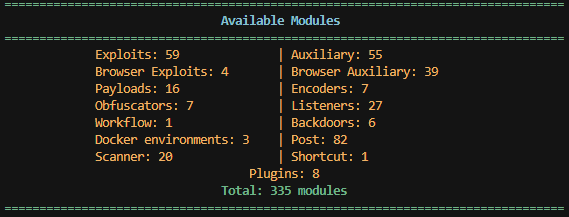
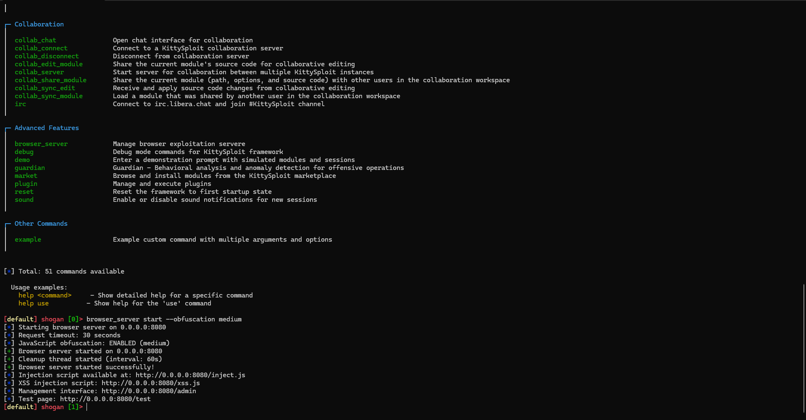
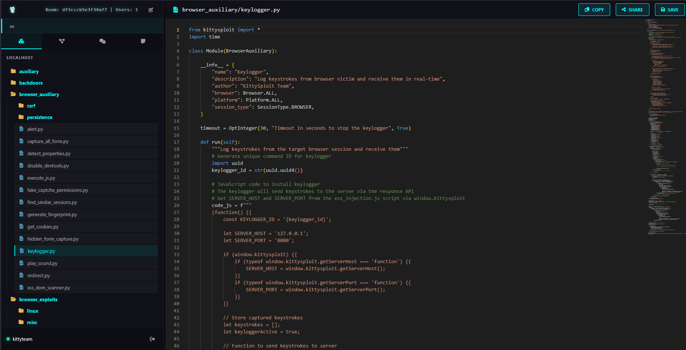
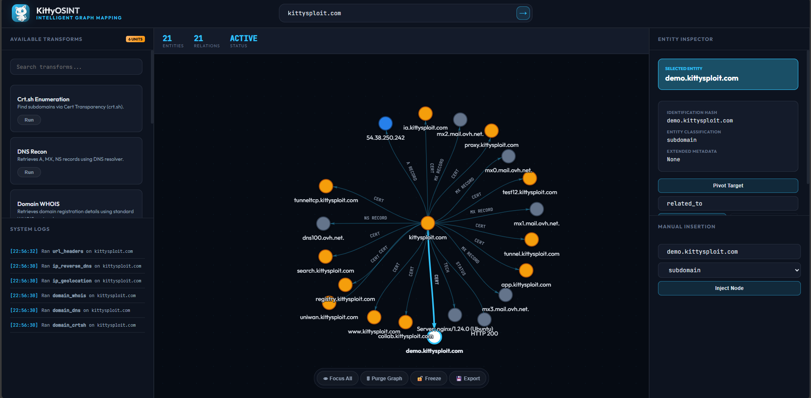
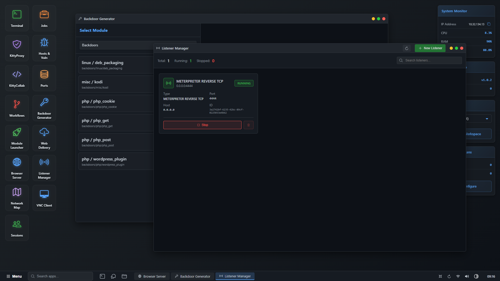

<div align="center">
  
  
  # KittySploit Framework
  ### Kill In The TTY
  
  **The Modern Penetration Testing Framework**
  
  [](https://www.python.org/)
  [](LICENSE)
  [](https://github.com/your-username/kittysploit-framework)
  
  *Modular • Extensible • Powerful*
  
  [Documentation](wiki/) • [Quick Start](#quick-start) • [Website](https://kittysploit.com)

<div align="center">
  
</div>

  **Install (Linux / macOS):**
  ```bash
  curl -fsSL https://raw.githubusercontent.com/SIA-IOTechnology/kittysploit-framework/main/install/install-standalone.sh | bash
  ```
</div>

---

## What is KittySploit?

KittySploit is a **next-generation penetration testing framework** that combines the power of traditional CLI tools with modern web interfaces, AI-assisted analysis, and real-time collaboration. Whether you're a solo researcher or part of a security team, KittySploit provides everything you need for effective penetration testing.

### Why Choose KittySploit?

- ** Fast & Modern** - Built with performance and usability in mind
- ** AI-Powered** - Intelligent vulnerability detection and module suggestions
- ** Collaborative** - Real-time team collaboration built-in
- ** Extensible** - Easy module development and marketplace integration
- ** Multi-Interface** - CLI, REST API, RPC, and Web interfaces
- ** Privacy-First** - Built-in Tor support for anonymous operations

## Quick Start

### Installation (30 seconds)

**One-line install (Linux / macOS) — clone + install in one command:**
```bash
curl -fsSL https://raw.githubusercontent.com/SIA-IOTechnology/kittysploit-framework/main/install/install-standalone.sh | bash
```
Installs to `~/kittysploit-framework` by default. To choose a directory:
```bash
curl -fsSL https://raw.githubusercontent.com/SIA-IOTechnology/kittysploit-framework/main/install/install-standalone.sh | bash -s -- /path/to/install
```

**Windows:**
```batch
install\install.bat
```

**Linux / macOS (from existing clone):**
```bash
chmod +x install/install.sh && ./install/install.sh
```

**Start using:**
```bash
python kittyconsole.py
```

> **Need detailed instructions?** Check out our [Complete Installation Guide](wiki/Installation.md)

---

## Key Features

### **KittyProxy** - Intelligent Web Proxy
- **AI-Powered Analysis** - Automatically detects technologies and suggests exploits
- **Real-Time Collaboration** - Work with your team on the same traffic
- **Smart Endpoint Discovery** - Extracts REST APIs, GraphQL, WebSockets automatically
- **Performance Analytics** - Deep insights into response times and bottlenecks
- **Request/Response Modification** - Intercept and modify traffic on-the-fly

### **KittyCollab** - Real-Time Collaboration
- **VS Code-like Editor** - Familiar editing experience with Monaco Editor
- **Live Synchronization** - Real-time code editing with your team
- **Integrated Chat** - Communicate while developing
- **Module Development** - Edit KittySploit modules directly in the browser

### **KittyOsint** - Intelligent Graph Mapping

### **Complete Module System**
- **Exploits** - Comprehensive exploit library for various vulnerabilities
- **Payloads** - Multi-platform payload generation (Python, Bash, PHP, Zig)
- **Scanners** - Fast vulnerability detection and assessment
- **Post-Exploitation** - Information gathering, pivoting, persistence
- **Workflows** - Automate complex attack chains
- **Browser Auxiliary** - Interact with hooked browsers (keylogging, cookie harvesting, form capture)
- **Browser Exploits** - Browser-based exploits via JavaScript injection
- **Auxiliary** - Scanners, fuzzers, enumerators, and DoS modules
- **Encoders** - Payload encoding and obfuscation (Base64, XOR, Unicode, etc.)

### **Multiple Interfaces**
- **CLI** - Powerful command-line interface
- **REST API** - Full framework control via HTTP
- **RPC Server** - Remote procedure calls for automation
- **Web Interfaces** - Beautiful web UIs for KittyProxy and KittyCollab

### **Privacy & Security**
- **Tor Integration** - Route all traffic through Tor
- **Session Management** - Secure multi-protocol session handling
- **Workspace Isolation** - Separate workspaces for different projects

---

## Screenshots

<div align="center">

### CLI Interface

*Interactive command-line interface with module management*

### KittyProxy Web Interface

*Analyse technologies, endpoints,...*


*AI-powered web proxy with real-time collaboration*

### KittyCollab Editor

*Real-time collaborative code editor*

### KittyOsint

*Osint - Intelligent graph mapping

### Module Marketplace

*Interface for kittysploit framework available on a marketplace*

</div>


---

## Requirements

- **Python:** 3.8 or higher
- **Disk Space:** 500 MB (for Zig compiler)
- **Docker:** Optional (for Docker environment modules)

## Installation

### Automatic Installation (Recommended)

The installer handles everything automatically:

**Linux / macOS — one line (clone + install):**
```bash
curl -fsSL https://raw.githubusercontent.com/SIA-IOTechnology/kittysploit-framework/main/install/install-standalone.sh | bash
```

**Windows:**
```batch
cd kittysploit-framework
install\install.bat
```

**Linux / macOS (from existing clone):**
```bash
cd kittysploit-framework
chmod +x install/install.sh
./install/install.sh
```

**What gets installed:**
- ✅ Python version check (3.8+)
- ✅ All required dependencies
- ✅ Zig compiler (0.16) for payload compilation
- ✅ Start scripts and shortcuts

### Manual Installation

For advanced users who prefer manual setup:

```bash
git clone https://github.com/your-username/kittysploit-framework.git
cd kittysploit-framework
python -m venv venv
source venv/bin/activate  # Windows: venv\Scripts\activate
pip install -r install/requirements.txt
```

> **Detailed installation guide:** [Installation.md](wiki/Installation.md)

## Usage

### Start KittySploit

**CLI Mode (Interactive):**
```bash
python kittyconsole.py
```

**REST API Server:**
```bash
python kittyapi.py -H 0.0.0.0 -p 5000 -m "master_key"
```

**RPC Server:**
```bash
python kittyrpc.py -H 0.0.0.0 -p 8888 -m "master_key"
```

### Start Components

**KittyProxy (Web Proxy):**
```bash
python kittyproxy.py
# Access at http://localhost:8000
```

**KittyCollab (Collaborative Editor):**
```bash
python kittycollab.py
# Access at http://localhost:5001
```

### Your First Exploit

```bash
# 1. Start KittySploit
python kittyconsole.py

# 2. Search for a module
kittysploit> search wordpress

# 3. Load an exploit
kittysploit> use exploits/http/wordpress_rce

# 4. Configure options
kittysploit (exploits/http/wordpress_rce)> set RHOST 192.168.1.100
kittysploit (exploits/http/wordpress_rce)> set RPORT 80

# 5. Execute
kittysploit (exploits/http/wordpress_rce)> run
```

> **Learn more:** [Getting Started Guide](wiki/Getting-Started.md) • [CLI Reference](wiki/CLI-Reference.md)

## Architecture

KittySploit is built with a modular architecture:

```
┌─────────────────────────────────────────┐
│         KittySploit Framework           │
├─────────────────────────────────────────┤
│  CLI  │  REST API  │  RPC  │  Web UIs   │
├─────────────────────────────────────────┤
│  Module System  │  Sessions  │  Tor     │
│  Scanners       │  Payloads  │  Proxy   │
│  Workflows      │  Marketplace          │
└─────────────────────────────────────────┘
```

> 📖 **Deep dive:** [Architecture Documentation](wiki/Architecture.md)

---

## Documentation

**Complete documentation is available in the [Wiki](wiki/):**

### Getting Started
- [Installation Guide](wiki/Installation.md) - Step-by-step installation
- [Getting Started](wiki/Getting-Started.md) - Your first steps
- [Examples](wiki/Examples.md) - Real-world usage examples

### Core Documentation
- [Modules](wiki/Modules.md) - Using modules
- [CLI Reference](wiki/CLI-Reference.md) - All commands
- [API Reference](wiki/API-Reference.md) - REST API
- [RPC Reference](wiki/RPC-Reference.md) - RPC server

### Components
- [KittyProxy](wiki/KittyProxy.md) - Web proxy with AI analysis
- [KittyCollab](wiki/KittyCollab.md) - Collaborative editor
- [Sessions](wiki/Sessions.md) - Session management
- [Listeners](wiki/Listeners.md) - Connection handlers
- [Payloads](wiki/Payloads.md) - Payload generation
- [Scanners](wiki/Scanners.md) - Vulnerability detection
- [Post-Exploitation](wiki/Post-Exploitation.md) - Post-exploit modules
- [Workflows](wiki/Workflows.md) - Automation

### Advanced
- [Configuration](wiki/Configuration.md) - Framework settings
- [Tor Integration](wiki/Tor-Integration.md) - Anonymous operations
- [Marketplace](wiki/Marketplace.md) - Module marketplace
- [Development](wiki/Development.md) - Create your own modules

### Help
- [FAQ](wiki/FAQ.md) - Frequently asked questions
- [Troubleshooting](wiki/Troubleshooting.md) - Problem solving

---

## Use Cases

### Penetration Testing
- Web application security testing
- Network penetration testing
- Post-exploitation activities
- Vulnerability assessment

### Security Research
- Exploit development
- Vulnerability research
- Security tool development
- Educational purposes

### Team Collaboration
- Real-time team coordination
- Shared exploit development
- Collaborative analysis
- Knowledge sharing

### Automation
- Automated vulnerability scanning
- Workflow automation
- CI/CD integration
- Custom tooling

---

## What Makes KittySploit Special?

### AI-Powered Intelligence
KittyProxy automatically analyzes traffic and suggests relevant exploits and scanners based on detected technologies.

### Built-in Collaboration
Work with your team in real-time using KittyCollab - no external tools needed.

### Extensible Marketplace
Install modules from the community marketplace or create your own.

### Modern Architecture
Built for performance, extensibility, and ease of use.

### Privacy First
Built-in Tor support for anonymous operations when needed.


## Contributing

We welcome contributions! Whether it's:
- Bug reports
- Feature requests
- Documentation improvements
- Code contributions
- Module submissions

See our [Contributing Guide](wiki/Contributing.md) for details.

## Project Status

- ✅ **Active Development** - Regular updates and improvements
- ✅ **Stable** - Production-ready for security testing
- ✅ **Well Documented** - Comprehensive wiki and examples
- ✅ **Community Driven** - Open source and community-focused

## Roadmap

- [ ] Enhanced AI capabilities
- [ ] More module types
- [ ] Improved UI/UX
- [ ] Performance optimizations
- [ ] Additional protocol support

## Support & Community

- **Website:** [app.kittysploit.com](https://kittysploit.com) - Official KittySploit web platform
- **Documentation:** [Wiki](wiki/)
- **Bug Reports:** [GitHub Issues](https://github.com/SIA-IOTechnology/kittysploit-framework/issues)
- **IRC:** [irc.libera.chat/#KittySploit](ircs://irc.libera.chat:6697/#KittySploit) - Join our IRC channel for real-time support

## ⚠️ Legal & Ethical Use

**KittySploit is a penetration testing tool intended for educational and authorized security purposes only.**

- ✅ Use only on systems you own
- ✅ Get explicit written permission before testing
- ✅ Follow all applicable laws and regulations
- ✅ Respect privacy and data protection
- ❌ Never use for unauthorized access
- ❌ Never use to harm others

**By using KittySploit, you agree to use it responsibly and ethically.**

## 📄 License

This project is licensed under the MIT License - see the [LICENSE](LICENSE) file for details.

---

<div align="center">
  <strong>Made with ❤️ by the KittySploit Team</strong>
  
  [🌐 Website](https://kittysploit.com)
</div>
