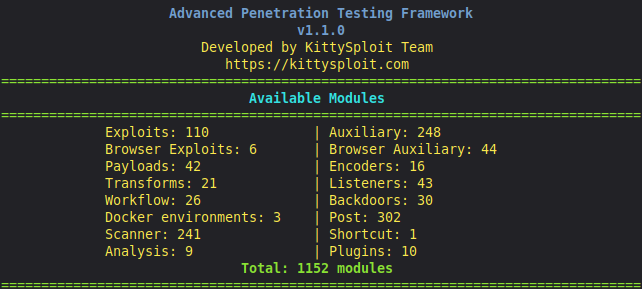
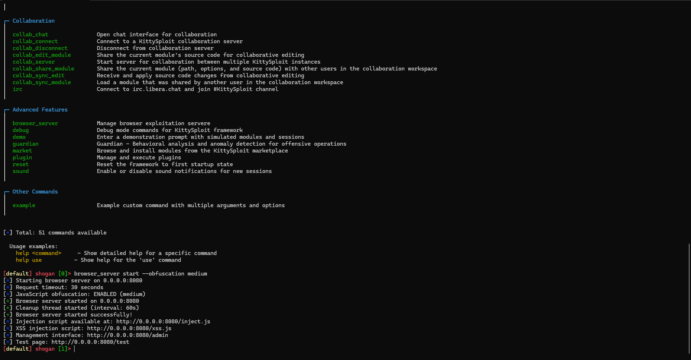
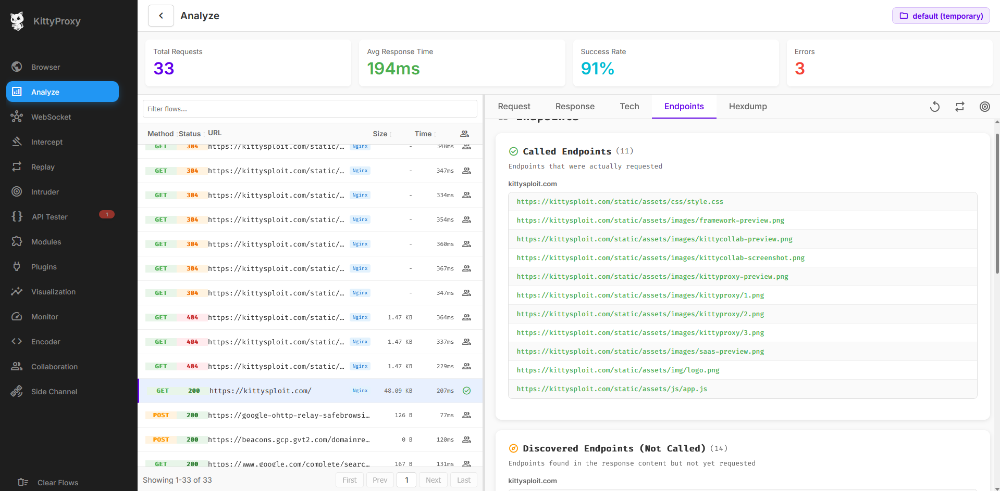

<div align="center">
  

  # KittySploit Framework
  ### *The Next-Gen Exploitation Engine for Modern Red Teams*

  [](https://www.python.org/)
  [](https://ziglang.org/)
  [](LICENSE)
  [](https://liberapay.com/KittySploit/donate)
  [](https://github.com/SIA-IOTechnology/Kittysploit-framework/stargazers)

  **[Website](https://kittysploit.com) • [Documentation](https://github.com/SIA-IOTechnology/Kittysploit-framework/wiki) • [Detailed Usage](USAGE.md) • [Marketplace](https://github.com/SIA-IOTechnology/Kittysploit-framework/wiki/Marketplace)**

  *Modular • Extensible • AI-Powered*
</div>

---

## ⚡ Why KittySploit?

While traditional tools struggle with modern web architectures and automated defense, KittySploit redefines the offensive landscape with cutting-edge tech:

| 🧠 **Autonomous AI** | 🛠️ **Zig Payloads** | 👥 **Live Collab** | 🌐 **Smart Proxy** |
| :--- | :--- | :--- | :--- |
| AI agents that plan attacks via local LLMs (Ollama). | Stealthy payloads compiled with integrated Zig 0.16. | Real-time shared editor for seamless team operations. | Auto-detects tech and runs modules directly from traffic. |

---

## ✨ Key Features

- **🤖 Autonomous Agent**: Feed a target, and the AI handles reconnaissance and suggests exploitation paths.
- **🚀 Ultra-Fast Core**: Dependency-free x64 polymorphic encoders and a high-performance Python core.
- **🛡️ Evasion-First**: Advanced obfuscation and multi-protocol session handling to bypass modern EDR/WAF.
- **🌐 KittyProxy**: Intelligent web proxy that auto-discovers REST APIs, GraphQL, and WebSockets.
- **🖥️ Modern Web UI**: Beautiful and intuitive graphical interfaces for proxy analysis and collaborative editing.
- **🔌 Marketplace**: Easily install or share new modules through our community-driven marketplace.

---

## 📸 Screenshots

<div align="center">
  
  <br><br>
  <table width="100%">
    <tr>
      <td width="50%"></td>
      <td width="50%"></td>
    </tr>
    <tr>
      <td align="center"><i>Interactive CLI</i></td>
      <td align="center"><i>AI-Powered Proxy</i></td>
    </tr>
  </table>
</div>

---

## 🚀 Quick Start

**Linux / macOS One-Liner:**
```bash
curl -fsSL https://raw.githubusercontent.com/SIA-IOTechnology/kittysploit-framework/main/install/install-standalone.sh | bash
```
or 
```bash
git clone https://github.com/SIA-IOTechnology/Kittysploit-framework && cd Kittysploit-framework && install\install.sh
``` 

**Windows:**
```batch
git clone https://github.com/SIA-IOTechnology/Kittysploit-framework && cd Kittysploit-framework && install\install.bat
```

**Start the Web UI:**
```bash
python kittyproxy.py  # Accessible at http://localhost:8000
```

---

## 🤖 Example: AI-Assisted Planning

Let the framework plan your attack using a local LLM:

```bash
# Start an autonomous agent with Llama 3.1
kittysploit agent target.com --llm-local --llm-model llama3.1:8b
```

---

## 📊 How We Compare

| Feature | KittySploit | Metasploit | Cobalt Strike |
| :--- | :---: | :---: | :---: |
| **Language** | Python / Zig | Ruby | Java |
| **Live Collaboration** | ✅ | ❌ | ✅ |
| **AI/LLM Planning** | ✅ | ❌ | ❌ |
| **Modern Payloads** | ✅ (Zig/ASM) | ⚠️ (C/ASM) | ✅ |
| **Native Tor Routing** | ✅ | ❌ | ⚠️ |
| **Integrated Marketplace** | ✅ | ❌ | ❌ |
| **GUI / Web UI** | ✅ | ❌ | ✅ |
| **Complex Workflows** | ✅ | ⚠️ | ✅ |
| **Open Source** | ✅ | ✅ | ❌ |

---

<div align="center">
  <h3>Ready to upgrade your arsenal?</h3>
  <p>If you find this project useful, please consider giving it a ⭐. It helps others discover the framework!</p>
  
  [🌐 Official Website](https://kittysploit.com) • [📄 MIT License](LICENSE) • [💖 Donate](https://liberapay.com/KittySploit/donate)
  
  [](https://liberapay.com/KittySploit/donate)
</div>
