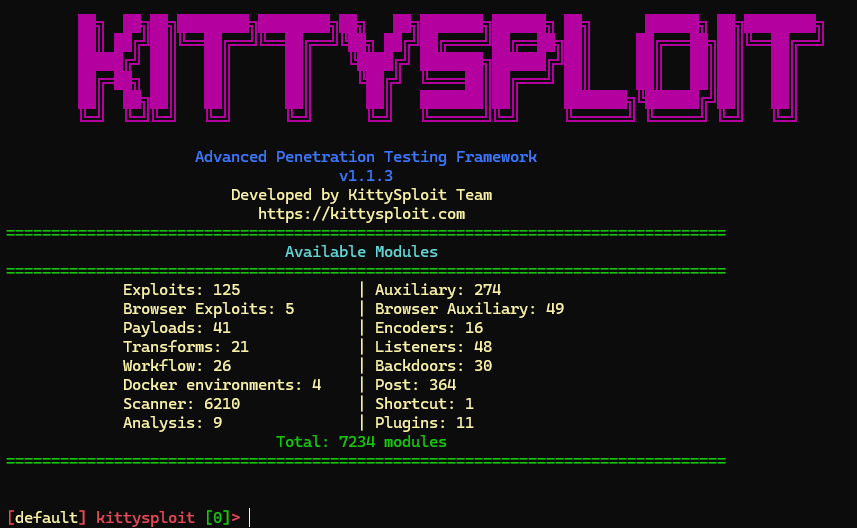

<div align="center">
  

# KittySploit

**A modular offensive security framework for pentesters, researchers and red teams.**

Scan targets, organize engagements, run security modules and build
AI-assisted testing plans from a single console.

[](https://www.python.org/)
[](LICENSE)
[](https://discord.gg/RNskjwSW5W)

**[Get started](#quick-start) · [Documentation](USAGE.md) · [Website](https://kittysploit.com) · [Discord](https://discord.gg/RNskjwSW5W)**

</div>



## Why KittySploit?

Security testing often requires separate tools for scanning, exploitation, traffic analysis, automation and engagement tracking.

KittySploit brings these workflows together in an extensible, Metasploit-inspired console built for modern security assessments.

* **Modular console** — search, configure and execute security modules.
* **Scanner and workflows** — automate repeatable reconnaissance and testing tasks.
* **Workspaces and scopes** — keep hosts, vulnerabilities and engagement boundaries organized.
* **AI-assisted planning** — use local Ollama models to analyze targets and prepare testing plans.
* **Extension ecosystem** — add proxy, OSINT, GUI and protocol-analysis capabilities.
* **Automation ready** — interactive console, one-shot commands, RPC and API modes.

## Quick Start

### Linux and macOS

```bash
git clone https://github.com/SIA-IOTechnology/Kittysploit-framework.git
cd Kittysploit-framework
./install/install.sh
python3 kittyconsole.py
```

A one-line installer is also available:

```bash
curl -fsSL https://raw.githubusercontent.com/SIA-IOTechnology/kittysploit-framework/main/install/install-standalone.sh | bash
```

### Windows

```batch
git clone https://github.com/SIA-IOTechnology/Kittysploit-framework.git
cd Kittysploit-framework
install\install.bat
python kittyconsole.py
```

## Your First Session

Verify the installation:

```text
kittysploit> doctor
```

Create a workspace and define the authorized scope:

```text
kittysploit> workspace create demo-lab
kittysploit> scope enable
kittysploit> scope allow ip 192.168.56.0/24
```

Search and inspect modules:

```text
kittysploit> search wordpress
kittysploit> show exploits
kittysploit> show auxiliary
```

Run a scanner against your local lab:

```text
kittysploit> scanner -u http://192.168.56.10
```

## AI-Assisted Planning

KittySploit can use a local Ollama model to prepare a testing plan without automatically launching intrusive actions:

```bash
kittysploit agent lab.local \
  --llm-local \
  --llm-model llama3.1:8b \
  --plan-only \
  --dry-run
```

The agent supports reconnaissance, analysis, planning, reporting and configurable safety profiles.

## KittySploit Ecosystem

| Project                                                                | Purpose                             |
| ---------------------------------------------------------------------- | ----------------------------------- |
| [KittyProxy](https://github.com/SIA-IOTechnology/KittyProxy)           | Web traffic capture and analysis    |
| [KittyCosmic](https://github.com/SIA-IOTechnology/KittyCosmic)         | Graphical interface and marketplace |
| [KittyOsint](https://github.com/SIA-IOTechnology/KittyOsint)           | Visual OSINT investigation          |
| [KittyProtocol](https://github.com/SIA-IOTechnology/KittyProtocol)     | Protocol analysis                   |
| [KittyV8Debugger](https://github.com/SIA-IOTechnology/KittyV8Debugger) | V8 debugging and analysis           |

[View more screenshots](docs/screenshots/) · [Read the complete usage guide](USAGE.md)

## Documentation

* [Usage guide](USAGE.md)
* [Project wiki](https://github.com/SIA-IOTechnology/Kittysploit-framework/wiki)
* [Extension marketplace](https://kittysploit.com)
* [Report a bug or request a feature](https://github.com/SIA-IOTechnology/Kittysploit-framework/issues)

## Project Status

KittySploit 1.x provides the foundation for a broader offensive security platform.

The framework is still evolving. Interfaces and workflows may change between releases, so validate new versions in a controlled lab before using them during an engagement.

## Community

KittySploit is open source and community-driven.

* Give the repository a ⭐ to help others discover it.
* Join the [Discord community](https://discord.gg/RNskjwSW5W).
* Open an issue to report a bug or suggest an improvement.
* Support development through [Liberapay](https://liberapay.com/KittySploit/donate).

## Acknowledgments

Thanks to [Woody](https://github.com/v-Woody) for their contributions.

## License

KittySploit is released under the [MIT License](LICENSE).
