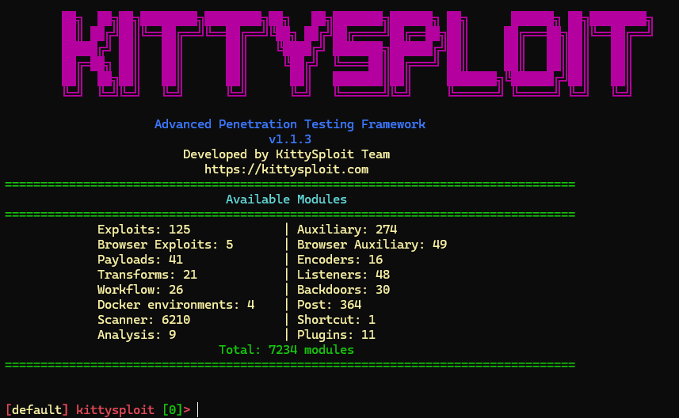
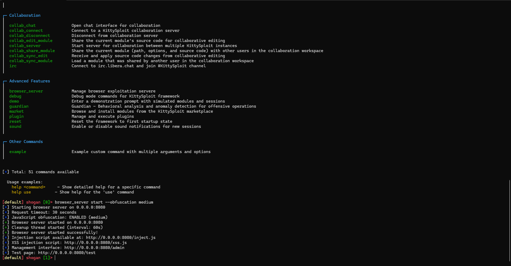

<div align="center">
  

# KittySploit

**From recon to shell — in one console.**

Autonomous agent for web/API testing. 8,000+ modules. Built-in C2.
Local LLM. Scope-aware. Automation-ready.

[](https://www.python.org/)
[](LICENSE)
[](https://discord.gg/RNskjwSW5W)
[](https://github.com/SIA-IOTechnology/Kittysploit-framework)

**[Quick start](#quick-start) · [Docs](USAGE.md) · [Website](https://kittysploit.com) · [Discord](https://discord.gg/RNskjwSW5W)**

</div>

<video src="docs/screenshots/demo.mp4" width="100%" controls autoplay muted loop playsinline>
  <a href="docs/screenshots/demo.mp4">Watch the KittySploit demo</a>
</video>



```bash
# Web/API mission (lab)
kittysploit> agent https://lab.local --profile owasp-web-parallel

# Go for a shell (authorized lab only)
kittysploit> agent http://192.168.56.10 \
  --profile internal-lab \
  --goal obtain-shell \
  --approve-risk intrusive \
  --shell-hunter
```

## Why KittySploit?

Most stacks force you to jump between a scanner, an exploit framework, a C2, a proxy, and a notebook.

KittySploit keeps the engagement in one place — modules, sessions, scope, and an autonomous agent that plans and executes against authorized targets.

| | |
|---|---|
| **Agent** | Local LLM (Ollama) plans and drives missions with safety profiles, evidence gates, and parallel web specialists |
| **Modules + C2** | 8,000+ scanners/exploits/post modules, listeners, payloads, and live sessions in the same console |
| **Automation** | CLI, RPC, REST API, and MCP for IDE / CI-style operators |

## Quick Start

### Linux and macOS

```bash
git clone https://github.com/SIA-IOTechnology/Kittysploit-framework.git
cd Kittysploit-framework
./install/install.sh
python3 kittyconsole.py
```

One-line installer:

```bash
curl -fsSL https://raw.githubusercontent.com/SIA-IOTechnology/kittysploit-framework/main/install/install-standalone.sh | bash
```

### Windows

```batch
git clone https://github.com/SIA-IOTechnology/Kittysploit-framework.git
cd Kittysploit-framework
install\install.bat
python kittyconsole.py
```

## First 60 seconds

```text
kittysploit> doctor
kittysploit> scanner -u http://192.168.56.10
kittysploit> search wordpress
kittysploit> agent https://lab.local --profile owasp-web-parallel --plan-only
kittysploit> agent http://192.168.56.10 --profile internal-lab --goal obtain-shell --approve-risk intrusive --shell-hunter
```

Use `--plan-only` / `--dry-run` until you are ready for live actions. Always test against systems you own or are authorized to assess.



## Autonomous agent

Drive a mission with a local model — no cloud key required:

```bash
# Plan only (safe preview)
kittysploit> agent lab.local \
  --llm-local \
  --llm-model llama3.1:8b \
  --profile owasp-web-parallel \
  --plan-only

# Obtain a shell (lab / authorized targets only)
kittysploit> agent http://192.168.56.10 \
  --profile internal-lab \
  --goal obtain-shell \
  --approve-risk intrusive \
  --shell-hunter \
  --llm-local \
  --llm-model llama3.1:8b
```

| Flag | Role |
| --- | --- |
| `--goal obtain-shell` | Campaign objective is an interactive session |
| `--approve-risk intrusive` | Required to run exploits (blocked otherwise) |
| `--shell-hunter` | Push harder toward a shell |
| `--approve-post-exploit` | Optional read-only collection after a session |
| `--plan-only` / `--dry-run` | Preview without live intrusive actions |

- Mission profiles (`safe-web`, `owasp-web-parallel`, `internal-lab`, `bug-bounty-safe`, …)
- Evidence-gated exploit handoff (reduce speculative false positives)
- Parallel specialists by OWASP class (injection, XSS, SSRF, auth, authz)
- Scope, budgets, and risk approvals stay under operator control

## Core platform

- **Modular console** — `search` / `use` / `set` / `run` across scanners, exploits, auxiliary, and post modules
- **Built-in C2** — listeners, payloads, sessions, pivots, and post-exploitation
- **Workspaces & scope** — engagement boundaries, hosts, and findings organized per job
- **Workflows & playbooks** — repeatable recon and attack chains
- **Extensions** — proxy, OSINT, GUI, protocols via the marketplace
- **Mobile companion** — QR pair for read-only engagement monitoring

## Ecosystem

| Project | Purpose |
| --- | --- |
| [KittyProxy](https://github.com/SIA-IOTechnology/KittyProxy) | Web traffic capture and analysis |
| [KittyCosmic](https://github.com/SIA-IOTechnology/KittyCosmic) | Graphical interface and marketplace |
| [KittyOsint](https://github.com/SIA-IOTechnology/KittyOsint) | Visual OSINT investigation |
| [KittyProtocol](https://github.com/SIA-IOTechnology/KittyProtocol) | Protocol analysis |
| [KittyV8Debugger](https://github.com/SIA-IOTechnology/KittyV8Debugger) | V8 debugging and analysis |

[Demo video](docs/screenshots/demo.mp4) · [More screenshots](docs/screenshots/) · [Full usage guide](USAGE.md)

## Documentation

- [Usage guide](USAGE.md)
- [Project wiki](https://github.com/SIA-IOTechnology/Kittysploit-framework/wiki)
- [Extension marketplace](https://kittysploit.com)
- [Issues](https://github.com/SIA-IOTechnology/Kittysploit-framework/issues)

## Project status

KittySploit 1.x is the foundation of a broader offensive platform and is still evolving. Validate new releases in a lab before using them on an engagement.

## Community

- Star the repo to help others discover it
- Join [Discord](https://discord.gg/RNskjwSW5W)
- Open an issue for bugs or ideas
- Support development on [Liberapay](https://liberapay.com/KittySploit/donate)

## Acknowledgments

Thanks to [Woody](https://github.com/v-Woody) for their contributions.

## License

KittySploit is released under the [MIT License](LICENSE).
